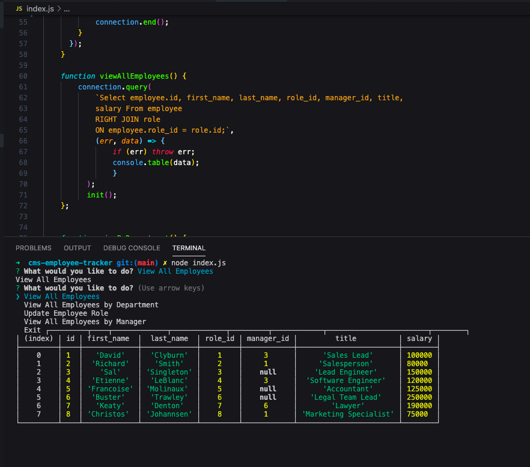
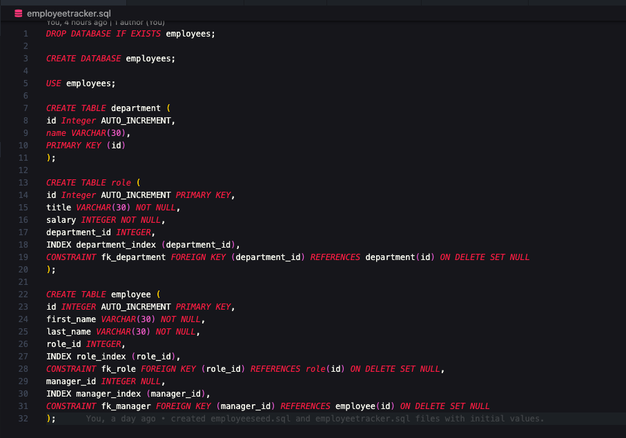

# cms-employee-tracker
This app is to architect and build a solution for managing a company's employees using node, inquirer, and MySQL

## Deployed Application Review
[Watch the video demonstrating the application here:]()

## Contents
This application contains an assets directory which holds all related project images and the instructions.md

In addition, it also contains the following files in the root to include this readme.md file.

*[employeeseed.sql](https://github.com/RFlanagan82/cms-employee-tracker/blob/main/employeeseed.sql)
*[employeetracker.sql](https://github.com/RFlanagan82/cms-employee-tracker/blob/main/employeetracker.sql)
*[index.js](https://github.com/RFlanagan82/cms-employee-tracker/blob/main/index.js)

*[package.json] - [package-lock.json] - [.gitignore] - [node modules]

## Application Requirements
These are referenced in the Submission Requirements section within [instructions.md](https://github.com/RFlanagan82/cms-employee-tracker/blob/main/assets/instructions.md)

## Usage Information
This application requires the following technologies and npm packages to work:

*[Node.js]
*[mySql]
*[Inquirer]

To start, clone this repo and run your terminal from index.js, on the command line via node index.js.

At that point you'll be prompted to select what you want to do.

If you click view all employees this is what you will see:

Or if you select view employees by department - this is what you will see:

For the bonus requirements: I also was able to successfully show employees by manager as shown here:

You'll notice that I have also created the following 2 sql files to support the datasets:

*[employeetracker.sql](https://github.com/RFlanagan82/cms-employee-tracker/blob/main/employeetracker.sql)

*[employeeseed.sql](https://github.com/RFlanagan82/cms-employee-tracker/blob/main/employeeseed.sql)

## Challenges

Although the first part of the Add Employee Role function works, I had significant challenges around, and ultimately wasn't successful in getting it to actually update the database.

Here is the error...

## Resources
* [Learn SQL: Join muliple tables](https://www.sqlshack.com/learn-sql-join-multiple-tables/)
* [SQL RIGHT Join Keyword](https://www.w3schools.com/sql/sql_join_right.asp)
* [SQL Left Join Keyword](https://www.w3schools.com/sql/sql_join_left.asp)
* [MySQL FOREIGN KEY Constraints](https://dev.mysql.com/doc/refman/5.6/en/create-table-foreign-keys.html)

## Credits and Contributions
On 10-6-2020, I spent some time during the lunch break listening to TA- Peter Colella work the Update Employee Role function with a fellow classmate.

Later that afternoon, I spent some time with my tutor, Andrew Hardemon - who helped me add in my Foreign Key values in the employeetracker.sql file, troubleshoot my View By Manager concat issues, and Employee Update Role function.

He also worked with me to help troubleshoot the Employee Update Role function before it was at the end of our time.

## Badge

## License
Copyright 2020 - <Ryan Flanagan>

Permission is hereby granted, free of charge, to any person obtaining a copy of this software and associated documentation files (the "Software"), to deal in the Software without restriction, including without limitation the rights to use, copy, modify, merge, publish, distribute, sublicense, and/or sell copies of the Software, and to permit persons to whom the Software is furnished to do so, subject to the following conditions:

The above copyright notice and this permission notice shall be included in all copies or substantial portions of the Software.

THE SOFTWARE IS PROVIDED "AS IS", WITHOUT WARRANTY OF ANY KIND, EXPRESS OR IMPLIED, INCLUDING BUT NOT LIMITED TO THE WARRANTIES OF MERCHANTABILITY, FITNESS FOR A PARTICULAR PURPOSE AND NONINFRINGEMENT. IN NO EVENT SHALL THE AUTHORS OR COPYRIGHT HOLDERS BE LIABLE FOR ANY CLAIM, DAMAGES OR OTHER LIABILITY, WHETHER IN AN ACTION OF CONTRACT, TORT OR OTHERWISE, ARISING FROM, OUT OF OR IN CONNECTION WITH THE SOFTWARE OR THE USE OR OTHER DEALINGS IN THE SOFTWARE.

